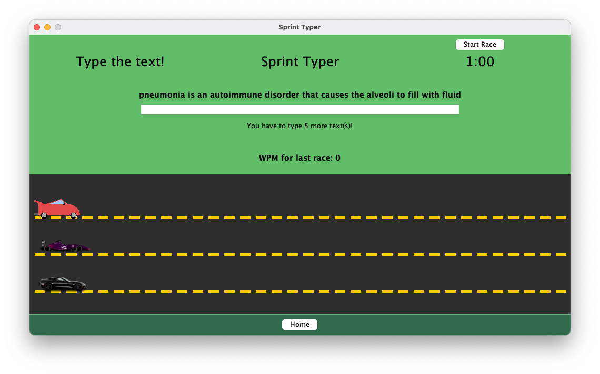

# SprintTyper

### About:
- This program is similar to [TypeRacer](https://typeracer.com), which is a game where you race against other live people by typing.
- This game is educational, and it requires the users to type texts about biology. After they finish typing the texts, they go through a short quiz.
- More information is available in-game.

### Running the program:
1. Clone the repository, I don't recommend downloading each and every single individual file.
2. Compile and run `SprintTyper.java` or use an editor that has a built-in compiler like [VS Code](https://code.visualstudio.com/).

